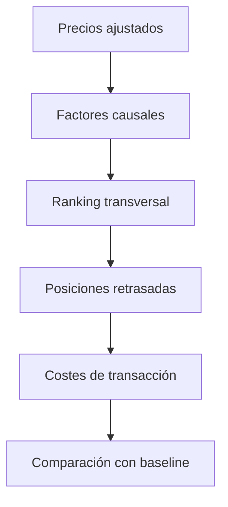

# Análisis cuantitativo de bancos españoles

Proyecto educativo para construir y evaluar señales técnicas sobre seis bancos españoles: BBVA, Santander, CaixaBank, Sabadell, Bankinter y Unicaja.

Aunque el nombre histórico del repositorio contiene *stock prediction*, el proyecto no intenta adivinar el precio exacto de la siguiente sesión. Su objetivo actual es más preciso: comprobar si un ranking cuantitativo sencillo mejora fuera de muestra una cartera equiponderada después de costes de transacción.

> No constituye asesoramiento financiero ni un sistema listo para operar con dinero real.

## Pregunta de análisis

> ¿Una selección causal de bancos basada en momentum, tendencia, volatilidad y drawdown supera una cartera equiponderada en el tramo temporal reservado para evaluación?

La comparación con un baseline es imprescindible. Un score puede producir rankings convincentes y, aun así, generar peor rentabilidad ajustada al riesgo que una estrategia pasiva.

## Activos

| Entidad | Ticker de Yahoo Finance |
|---|---|
| BBVA | `BBVA.MC` |
| Banco Santander | `SAN.MC` |
| CaixaBank | `CABK.MC` |
| Banco Sabadell | `SAB.MC` |
| Bankinter | `BKT.MC` |
| Unicaja Banco | `UNI.MC` |

## Metodología

El score transversal combina cuatro factores calculados en cada fecha:

| Factor | Peso | Definición |
|---|---:|---|
| Momentum | 35 % | Rentabilidad de las últimas 63 sesiones |
| Tendencia | 30 % | Distancia del precio respecto a la SMA de 200 sesiones |
| Baja volatilidad | 20 % | Volatilidad anualizada de 63 sesiones, invertida en el ranking |
| Drawdown | 15 % | Distancia respecto al máximo móvil de 252 sesiones |

Cada factor se transforma en un percentil entre los bancos disponibles. Solo son elegibles los activos cuyo precio está por encima de su media de 200 sesiones y la estrategia reparte el capital entre los dos scores más altos.

### Controles temporales

1. Los indicadores utilizan únicamente observaciones pasadas y presentes.
2. La posición calculada al cierre de una sesión se retrasa un día antes de aplicarse.
3. Las métricas se calculan exclusivamente sobre el 30 % final de las fechas.
4. Se descuentan 10 puntos básicos por unidad de rotación.
5. El benchmark invierte el mismo capital en cada activo al inicio del test y mantiene las participaciones sin rebalancear.

No se optimizan pesos ni umbrales sobre el test. Aun así, una única división temporal no basta para demostrar capacidad predictiva.

## Arquitectura



## Demostración reproducible

El repositorio incluye `data/sample_prices.csv`, una serie **sintética y determinista**. Permite ejecutar y probar todo el pipeline sin conexión a Internet; no debe interpretarse como evidencia sobre el mercado real.

```powershell
python run_analysis.py
```

Resultados de la muestra versionada:

| Cartera | Rentabilidad total | CAGR | Volatilidad anual | Sharpe (rf=0) | Máximo drawdown |
|---|---:|---:|---:|---:|---:|
| Estrategia técnica | 3,29 % | 2,76 % | 16,26 % | 0,25 | -16,51 % |
| Equiponderada | 19,63 % | 16,25 % | 18,17 % | 0,92 | -15,50 % |

En esta muestra, la estrategia técnica **no supera** al baseline. Este resultado negativo es informativo: una narrativa técnica plausible no garantiza valor predictivo y debe contrastarse cuantitativamente.

Los resultados se guardan en `reports/generated/`:

- `backtest_metrics.csv`
- `backtest_daily.csv`
- `latest_scores.csv`
- `equity_curve.png`

## Ejecución con datos actuales

La descarga mediante Yahoo Finance requiere conexión a Internet:

```powershell
python run_analysis.py --source yahoo --start 2017-01-01
```

Opciones principales:

```powershell
python run_analysis.py --help
python run_analysis.py --top-n 3 --cost-bps 15 --test-size 0.25
```

Los resultados actuales pueden cambiar por revisiones del proveedor, fecha de consulta y disponibilidad de cada ticker. No se versionan como una recomendación vigente.

## Instalación

Desarrollado para Python 3.12:

```powershell
py -3.12 -m venv .venv
.\.venv\Scripts\Activate.ps1
python -m pip install --upgrade pip
python -m pip install -r requirements.txt
```

Ejecutar el notebook:

```powershell
python -m jupyter notebook notebooks/02_backtest_reproducible.ipynb
```

## Pruebas

```powershell
python -m pip install -r requirements-test.txt
python -m pytest -q
```

Las pruebas verifican, entre otros aspectos, que modificar precios futuros no altere posiciones históricas y que añadir costes nunca mejore artificialmente la rentabilidad.

## Notebooks

| Archivo | Propósito |
|---|---|
| `notebooks/01_exploracion_original.ipynb` | Trabajo inicial conservado para mostrar la evolución del proyecto; sus recomendaciones no están validadas mediante backtesting |
| `notebooks/02_backtest_reproducible.ipynb` | Versión actual, modular y evaluada frente a baseline |

## Estructura

```text
.
├── data/sample_prices.csv
├── notebooks/
│   ├── 01_exploracion_original.ipynb
│   └── 02_backtest_reproducible.ipynb
├── reports/generated/
├── src/
│   ├── backtest.py
│   ├── data.py
│   ├── reporting.py
│   └── signals.py
├── tests/
├── run_analysis.py
└── requirements*.txt
```

## Limitaciones

- La muestra incluida es sintética y solo valida el funcionamiento del código.
- La evaluación utiliza una única partición temporal; falta validación *walk-forward*.
- Los pesos de los factores son hipótesis explícitas, no parámetros estimados de forma concluyente.
- El modelo omite dividendos, impuestos, deslizamiento, horquillas y restricciones de liquidez.
- El universo contiene empresas del mismo sector y ofrece poca diversificación estructural.
- El Sharpe usa un tipo libre de riesgo igual a cero.
- Un score alto expresa posición relativa dentro del universo, no probabilidad de subida.

## Autor

Jorge Galán Rodríguez — [GitHub](https://github.com/jorgegalanr) · [LinkedIn](https://linkedin.com/in/jorgegalanrodriguez)

## Licencia

MIT.
